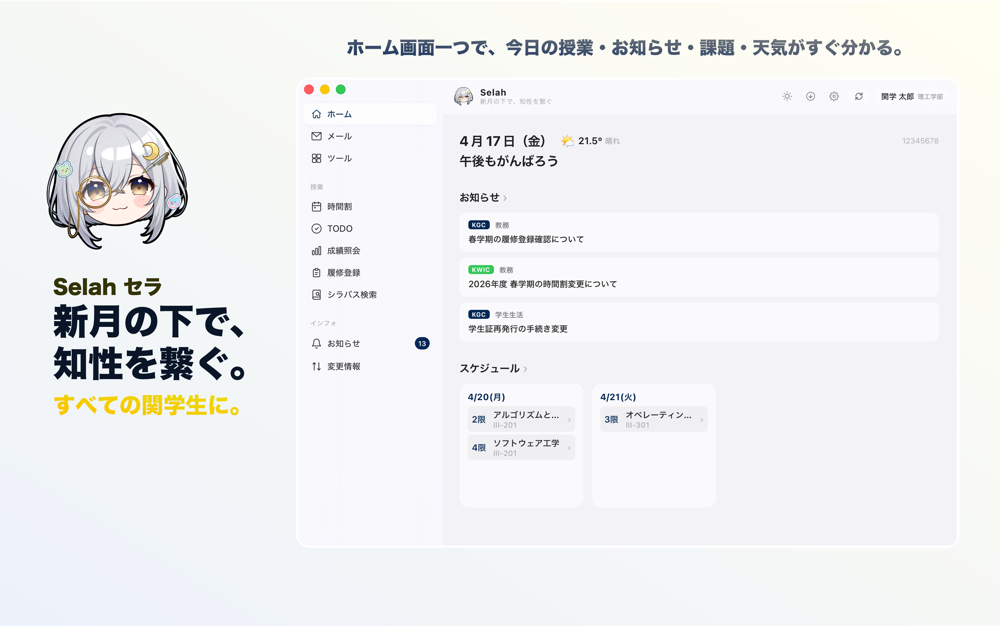
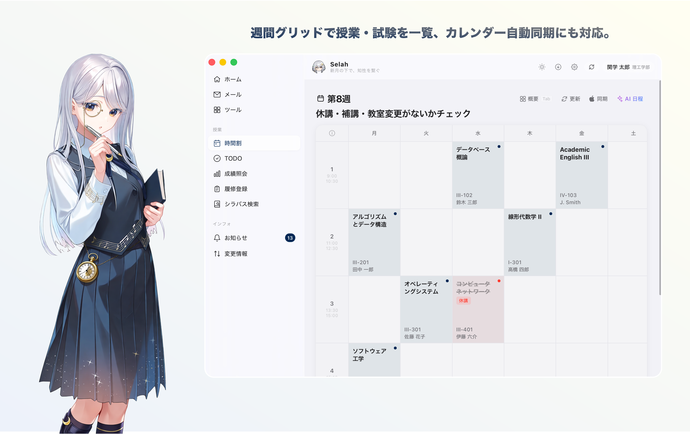
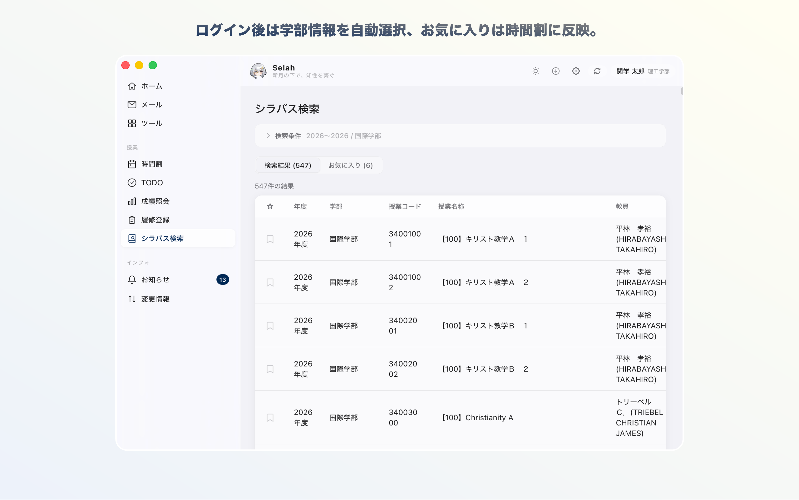

<p align="center">
  
</p>

<h1 align="center">Selah</h1>

<p align="center">
  新月の下で、知性を繋ぐ。すべての関学生に。
</p>

<p align="center">
  <a href="../../releases/latest"></a>
  
  
</p>

---

> **注意**: Selah は関西学院大学の学生向けサードパーティデスクトップクライアントです。個人開発の source-available プロジェクトであり、大学の公式アプリケーションではありません。

Selah は関西学院大学の教務システム **KWIC** と学習管理システム **Luna (LMS)**、さらに大学の **Microsoft 365 メール**のデータを統合し、ネイティブデスクトップアプリとして提供します。ユーザー自身の大学アカウントで SSO ログインし、自分のデータにアクセスします——ブラウザでのログインと同じ体験です。macOS / Windows の両プラットフォームに対応しています。

## 画面紹介

毎日よく使う 3 つの画面を中心に、Selah の使いどころがひと目で伝わるようにしました。

<table border="0" cellspacing="12" cellpadding="0">
  <tr>
    <td width="50%" valign="top">
      
      <strong>ホーム</strong><br>
      今日の授業、お知らせ、締切、天気を 1 画面にまとめて確認できます。
    </td>
    <td width="50%" valign="top">
      
      <strong>時間割</strong><br>
      週間グリッドで授業と試験を一覧表示し、カレンダー同期や AI 日程機能にも対応します。
    </td>
  </tr>
  <tr>
    <td width="50%" valign="top">
      
      <strong>シラバス検索</strong><br>
      ログイン後の学部情報を引き継ぎ、お気に入り登録した科目は時間割へ反映できます。
    </td>
    <td width="50%"></td>
  </tr>
</table>

## 機能一覧

### ホーム

ダッシュボード画面。ログイン後に最初に表示されます。

- 時間帯に応じた挨拶メッセージ（朝・昼・夕・夜で変化）
- **NOW / NEXT** — 現在進行中または次の授業をカードで表示
- 直近のお知らせ（KWIC・Luna 統合、最新 3 件）
- スケジュール — 今日・明日の授業一覧をタイル表示
- 締切が近い課題（5 日以内）を緊急度別に色分け表示
- 天気情報の表示（Open-Meteo API による西宮上ケ原キャンパスの気温・天候・翌日予報）
- **KWIC ポータルリンク** — KWIC ホームページのメインリンクをカード表示。クリックでサブポータル画面に移行し関連リンク・お知らせを確認可能

### メール

- 大学の Microsoft 365 メールの受信トレイを表示
- メール本文のプレビュー・閲覧
- ページング対応

### 時間割

- KWIC の週間時間割をグリッド表示（月〜土、1〜7 限）
- Luna の時間割データとの統合表示
- 週単位のナビゲーション（前週 / 次週）
- 試験時間割の表示
- シラバスお気に入りを時間割上にオーバーレイ表示
- **Google カレンダー同期** — OAuth 連携で時間割を Google カレンダーへ自動エクスポート（変更検知による差分同期）
- **AI 履修分析** — ローカル AI または OpenAI / Gemini API を使い、成績・履修状況・シラバスを基に履修アドバイスレポートを生成

### TODO

- Luna (LMS) の課題・提出物を一覧表示
- 未提出 / 提出済のステータス管理
- 締切日の表示、期限超過の強調表示
- 課題の詳細をクリックで別ウィンドウ表示
- **レポート提出** — 詳細ウィンドウからファイル添付・コメント入力を行いレポートを直接提出
- **掲示板投稿** — Luna の掲示板 (Forum) スレッドへの返信投稿に対応
- **添付ファイルのダウンロード** — 課題やフォーラムに添付された PDF・Office 文書などをアプリ内から取得（科目別フォルダ振り分けに対応）
- **AI 学習アシスト** — ローカル AI または OpenAI / Gemini API を使い、時間割・シラバス・締切を踏まえた学習計画とタスクごとの取り組み方ガイドを生成（結果は 6 時間キャッシュ）

### 成績照会

- 系列ごとの必要単位・履修単位・修得単位をテーブル表示
- 学生情報バー（氏名・学籍番号・学部・学科・年次）

### 履修登録

- 登録済み科目の一覧（曜日・時限・学期・授業名・教員・単位・状態）
- 単位数サマリーのカード表示
- 履修登録画面を別ウィンドウで表示

### シラバス検索

- 年度・学期・キャンパス・学部・曜日時限・キーワード・教員名・使用言語による検索
- 検索結果のテーブル表示
- お気に入り（ブックマーク）機能 — お気に入りに登録したシラバスは時間割にも表示可能

### お知らせ

- KWIC のお知らせと Luna の通知を統合表示
- カテゴリタブで切り替え（呼出し・重要なお知らせ / 学部・研究科からのお知らせ / 授業のお知らせ / その他）
- 授業のお知らせタブ内で科目ごとのフィルター表示
- 新着通知のネイティブ通知（macOS 通知センター / Windows トースト連携）
- 通知カテゴリ別のオン / オフ切り替え（重要 / 学部 / 授業 / その他 / メール）。授業通知はさらに種類別（一般・お知らせ・課題・テスト・掲示板・アンケート・出席）に細かく制御可能
- Luna の通知はクリックで詳細画面を別ウィンドウ表示
- **AI 通知サマリー** — 重要通知の本文を自動取得し、要点・アクション項目を AI で抽出

### 変更情報

- 休講情報・補講情報・教室変更をタブで切り替え表示
- 自分の学部の情報を優先表示

### LIVE 講義文字起こし

授業中にリアルタイムで音声を文字起こしし、AI が一定間隔でセッションを要約します。

- **リアルタイム STT** — オンデバイスの SenseVoice モデルで発話を即時テキスト化（日英対応）
- **定期 AI 要約** — 設定した間隔（5〜30 分）ごとに講義内容を自動要約
- **セッション管理** — 開始 / 一時停止 / 再開 / 終了に対応。科目ごとに当日分の記録をキャッシュ
- **自由ノート** — 授業以外の自由録音モード（科目選択不要）
- **字幕オーバーレイ** — macOS では Dynamic Island 風のガラスカプセルをスクリーン下部に表示し、発話テキストをリアルタイムでオーバーレイ
- **ファイル書き出し** — セッション終了時に文字起こしと AI 要約を Markdown ファイルとして保存

### Selah Agent

タイトルバーの Selah アイコンから呼び出せる対話型 AI エージェント。

- 時間割・課題・お知らせ・メール・シラバスといったユーザーデータへのツール呼び出しを伴う複数ターン推論
- **音声入力** — 組み込みの日英対応 STT モデル（SenseVoice）で、発話をそのまま入力として送信可能
- **会話履歴の永続化** — 過去のやり取りはローカル DB に保存され、会話単位でリネーム・削除が可能
- メッセージ単位のコピー・引用返信に対応

### その他

- **SSO 認証連携** — 内蔵 WebView で大学の SSO ログイン画面を表示し、ユーザー自身が認証を行います。ブラウザでのログインと同じ大学の SSO 画面を使用し、認証セッションをネイティブ HTTP クライアントと共有。KG-Course・Luna・KWIC の 3 系統を一度のログインで認証
- **セッション自動管理** — セッション有効期限の自動検証、期限切れ時の自動再ログイン
- **バックグラウンドポーリング** — 時間割・お知らせ・TODO・メールなどを定期的に取得し、キャッシュを自動更新
- **ローカル DB キャッシュ** — SQLite (WAL モード) による永続キャッシュと SWR 方式での高速起動、ネットワーク不通時のオフラインフォールバック
- **ローカル AI モデル** — Qwen 系のコンパクトモデルを llama.cpp 経由でオンデバイス実行。API キー不要で、ネットワーク不通時も AI 機能を利用可能（Metal / Vulkan によるハードウェア高速化対応）
- **統合設定画面** — AI・セッション・メール・カレンダー・通知・ダウンロード先をすべてアプリ内で設定可能（デバッグコンソールはバージョン表記を 7 回タップでアンロック）
- **トレイステータス** — メニューバー / タスクトレイに現在の授業・次の授業・未提出課題などをサイクル表示。クリックでポップアップに詳細を表示
- **デモモード** — 実データを用いず匿名サンプルデータでアプリを体験可能
- **ICT ツール** — 施設予約・Zoom・Box・Slack・OneDrive・リモート PC・別名アドレス設定など、大学 ICT サービスへのクイックアクセス
- **ネイティブ UI** — macOS ではタイトルバーオーバーレイ・トラフィックライト対応、Windows では NSIS インストーラー・トースト通知に対応
- **セキュリティ** — Cookie・セッション・API キーは macOS Keychain / Windows Credential Manager に保存。その他のトークンファイルには Unix 上で制限付きパーミッション (0600) を設定。「すべてのローカルデータを削除」メニューで永続データを完全消去できます

## 技術スタック

| レイヤー | 技術 |
|---------|------|
| フレームワーク | [Tauri 2](https://tauri.app/) |
| フロントエンド | [Svelte 5](https://svelte.dev/) + TypeScript |
| バックエンド | Rust (reqwest, scraper, tokio, rusqlite) |
| 認証 | SSO セッション連携 (WKWebView / WebView2) |
| キャッシュ | SQLite (WAL モード) |
| AI 統合 | ローカル (llama-cpp-2 + Qwen、Metal / Vulkan 高速化) / OpenAI / Google Gemini |
| 音声認識 (STT) | sherpa-onnx + SenseVoice（オンデバイス、日英対応） |
| ビルドツール | [Vite](https://vitejs.dev/) |
| パッケージ | macOS: DMG / .app (universal binary) / Mac App Store ／ Windows: NSIS / Microsoft Store |

## ビルド

### 前提条件

- Node.js 20+
- Rust 1.80.0+
  - macOS: `aarch64-apple-darwin`, `x86_64-apple-darwin` (macOS 11.0+)
  - Windows: `x86_64-pc-windows-msvc` (Windows 10/11, WebView2 ランタイム)

### 手順

```bash
# 依存関係のインストール
npm install

# 開発サーバー起動
npm run tauri dev

# プロダクションビルド (macOS universal)
npm run tauri build -- --target universal-apple-darwin

# プロダクションビルド (Windows)
npm run tauri build -- --target x86_64-pc-windows-msvc
```

ビルド成果物は `src-tauri/target/release/bundle/` に出力されます（macOS: `dmg/`, `macos/` ／ Windows: `nsis/`）。

## ダウンロードとインストール

最新のインストーラーは [Releases](../../releases/latest) ページから取得できます。お使いのプラットフォームに合わせて以下を選択してください。

| プラットフォーム | ファイル | 対応 |
|---|---|---|
| macOS (Apple Silicon / Intel) | `Selah_x.y.z_universal.dmg` | macOS 11.0 Big Sur 以降 |
| Windows (x64) | `Selah_x.y.z_x64-setup.exe` | Windows 10 / 11 (x64) |

### macOS

1. Releases ページから `Selah_x.y.z_universal.dmg` をダウンロードします。
2. DMG をダブルクリックして開き、**Selah.app** を `Applications` フォルダへドラッグ & ドロップします。
3. 初回起動時に「開発元を確認できないため開けません」と表示された場合:
   - Finder で `アプリケーション` フォルダを開き、**Selah.app** を **右クリック → 開く** を選択してください。
   - macOS Sequoia 以降では、一度開こうとした後に **システム設定 → プライバシーとセキュリティ** の一番下にある「このまま開く」を押す必要があります。
4. 初回起動時に SSO ログイン画面が表示されます。関学 ID とパスワードを入力してください（認証は内蔵 WebView 内で完結し、認証情報は外部に送信されません）。

> Selah は現在コード署名されていません。ダウンロード後に `xattr` による隔離属性が付与されている場合は、ターミナルで以下を実行すると Gatekeeper の警告を回避できます。
>
> ```bash
> xattr -dr com.apple.quarantine /Applications/Selah.app
> ```

### Windows

1. Releases ページから `Selah_x.y.z_x64-setup.exe` をダウンロードします。
2. インストーラーを実行します。**Windows SmartScreen** の警告が表示された場合は「詳細情報」→「実行」を選択してください。
3. ウィザードの指示に従ってインストールを完了します（既定の場所は `%LOCALAPPDATA%\Programs\Selah`）。
4. **WebView2 ランタイム** が未インストールの場合、Windows 11 には標準で含まれていますが、Windows 10 では [Microsoft Edge WebView2 ランタイム](https://developer.microsoft.com/microsoft-edge/webview2/) を別途インストールしてください。
5. スタートメニューから Selah を起動し、SSO ログイン画面で認証を行います。

### アップデート

- **自動更新に対応しています。** 起動時またはメニューから更新を確認し、ダウンロードとインストールをアプリ内で完結できます。
- **直接配布ビルド** (GitHub Releases) は Tauri updater が `latest.json` を参照し、新しいバージョンが見つかれば自動ダウンロード＆インストールを行います。
- **Mac App Store / Microsoft Store ビルド** は各ストアのアップデート機能を通じて配信されます（アプリ内の自動更新は無効になります）。
- アップデート後も設定・キャッシュは保持されます（ユーザーデータは `~/Library/Application Support/com.kgu.selah/` / `%APPDATA%\com.kgu.selah\` に残ります）。

### アンインストール

- **macOS**: `アプリケーション` フォルダから `Selah.app` を削除します。ユーザーデータを完全に消去する場合は `~/Library/Application Support/com.kgu.selah/` も削除してください。
- **Windows**: 設定 → アプリ → インストールされているアプリ から「Selah」をアンインストールします。ユーザーデータは `%APPDATA%\com.kgu.selah\` に保存されます。

## プライバシー

Selah はユーザーのプライバシーを尊重し、**必要最小限のデータのみ**を扱います。

### 通信先

Selah が通信を行う外部サービスは以下のみです。いずれもアプリの機能提供に必要なものであり、広告・分析・トラッキング目的の通信は一切行いません。

| 通信先 | 目的 | 備考 |
|--------|------|------|
| 関西学院大学 SSO (Okta) | ログイン認証 | 内蔵 WebView 内で完結 |
| KWIC (`kwic.kwansei.ac.jp`) | 教務情報の取得 | 時間割・成績・お知らせ等 |
| Luna (`luna.kwansei.ac.jp`) | LMS データの取得 | 課題・通知・シラバス等 |
| Microsoft 365 (`graph.microsoft.com`) | 大学メールの取得 | OAuth 認証、Mail.ReadWrite スコープ |
| Google Calendar API | カレンダー同期 | ユーザーが同期を有効にした場合のみ |
| OpenAI / Google Gemini API | クラウド AI アシスト機能 | ユーザーがプロバイダを選び API キーを設定した場合のみ |
| モデル配布元 (Hugging Face 等) | ローカル AI モデルのダウンロード | ユーザーがローカルモデルを選択しダウンロードした場合のみ。推論中の通信は一切発生しません |
| Open-Meteo API | 天気情報の取得 | 大学キャンパスの固定座標のみ送信（位置情報は取得しません） |

### データの保存

- **認証情報（Cookie・セッショントークン・API キー）** は OS のキーチェーン (macOS Keychain / Windows Credential Manager) またはパーミッション制限付き (0600) のローカルファイルに保存されます。平文でディスクに書き出されることはありません。
- **キャッシュデータ（時間割・成績・お知らせ等）** はローカルの SQLite データベース (`~/Library/Application Support/com.kgu.selah/` / `%APPDATA%\com.kgu.selah\`) に保存されます。
- すべてのデータはユーザーの端末内にのみ存在し、開発者を含む第三者がアクセスすることはできません。

### 収集しないもの

- アナリティクス・テレメトリ・クラッシュレポートは一切送信しません
- デバイス識別子・広告 ID・フィンガープリントは収集しません
- ユーザーの位置情報は取得しません（天気機能はキャンパスの固定座標を使用）
- ユーザーデータを第三者と共有・販売することはありません

### AI 機能について

AI アシスト機能（履修分析・学習計画・通知サマリー・Selah Agent）は、ユーザーが選択したプロバイダに応じて以下のいずれかで動作します。

- **ローカルモデル**: llama.cpp で端末内推論。推論データはネットワークに一切送信されません（音声認識 (STT) も同様にオンデバイス）。
- **クラウド (OpenAI / Gemini)**: ユーザーが設定した API キーで直接プロバイダに接続。開発者のサーバーを経由することはありません。

AI への送信内容は時間割・シラバス・成績などの学術データに限られます。API キーは OS のキーチェーンに安全に保存されます。

## 免責事項

- 本アプリは個人開発のサードパーティクライアントであり、大学の公式アプリケーションではありません。
- ユーザー自身が大学の SSO ログイン画面で認証を行い、自分のデータにアクセスします。ブラウザでの利用と同等の操作です。
- 認証情報はローカルマシン上でのみ処理され、第三者サーバーには送信されません。
- 大学側のシステム変更により、予告なく動作しなくなる可能性があります。
- 利用は自己責任でお願いします。

## キャラクター

<p align="center">
  
</p>

<p align="center">
  <strong>Selah</strong> — アプリのマスコットキャラクター。
</p>

## ライセンス

[PolyForm Noncommercial License 1.0.0](LICENSE) の下で公開されています。非商用目的での使用・改変・配布は許可されますが、商用利用には別途許可が必要です。

第三者ライブラリは各 upstream のライセンスに従います。詳細は [THIRD_PARTY_NOTICES.md](THIRD_PARTY_NOTICES.md) を参照してください。
