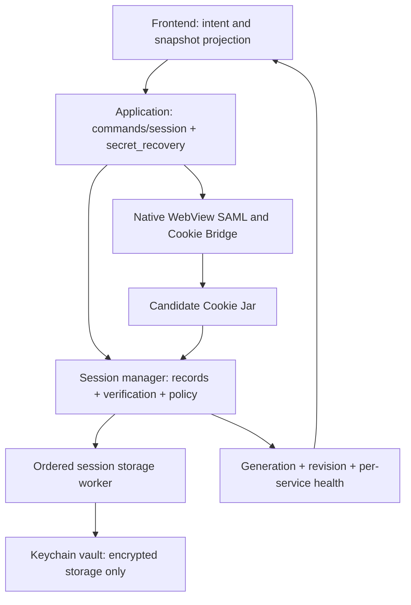

# SSO session architecture and persistence

Implemented on 2026-10-09. Scope: the existing university SAML / Cookie Bridge
architecture, without school-managed OAuth registration or official API access.
Local persistence cannot extend upstream authorization, MFA, or device-trust policy.

## Authentication ownership

`session_coordinator` is the single native owner of the three accepted service
records: transport, Cookie Jar, credential presence, KGC identity, verification
health, authentication generation, and snapshot revision. `KgcState`,
`LunaState`, and `KwicState` are read-only handles. They cannot replace or clear
credentials. KGC additionally owns a request gate because its Struts session
has a single form token.

Restoring credentials produces `unverified`, never `valid`. Only positive server
evidence can mark a session verified. HTTP failures become `unavailable` and
retain the accepted credentials and previous proof; confirmed expiry removes
the saved jar. KGC expiry retains an identity-only record with an empty jar so
offline data keeps its account owner without claiming valid credentials. Explicit
logout removes that identity too. Hidden SAML verifies a candidate before replacing a live jar.
An account change retires both secondary services atomically with accepting the
new KGC identity. Every validation result checks generation **and** jar identity
under the same state lock, including failures from ordinary KGC data requests.

Visible login, hidden SAML and reset share one authentication gate. Logout
invalidates work before waiting for that gate; canceled windows close through
a scope guard. `sessionLifetime.ts` discards obsolete requests, queued work and
callbacks. A monotonically increasing snapshot revision also prevents older
responses within the same login generation from overwriting newer state.

### Recovery policy and contracts

All callers submit a `RecoveryTrigger`: manual, failed request, automatic data
request, startup, foreground, background, or keepalive. One native policy owns
flow spacing, overlapping-result reuse, probe reuse, retry backoff, and the
six-hour core keepalive. KGC is only recovered for an explicit user action or an
actual KGC request. Background failures back off from 10 minutes to 2 hours;
automatic KGC recovery waits 30 minutes. Manual/request recovery can bypass the
long background delay while retaining a 2-second successful / 30-second failed
minimum spacing. Skipped work never advances the deadline. Internal deadlines
use monotonic elapsed time, with wall-clock retry times supplied only for display.

`sync_session` returns one result per requested service: `verified`,
`needs_login`, `unavailable`, `deferred`, or `signed_out`, plus the authoritative
snapshot and identity. Results distinguish freshly recovered sessions from
sessions that merely passed validation; partial success is not collapsed to a
single boolean. Cancellation, invalid input, storage failure and validation
failure have structured error variants.

The frontend supplies the service explicitly and projects native snapshots.
It does not classify Japanese error messages, decide SAML retry/backoff, or
interpret network failure as logout. Startup submits one native recovery
request. A read may retry once after actual recovery; mutations are not replayed.
Frontend event throttling and lifetime cancellation only control UI work.
An offline shell can use saved identity without claiming the services are valid.

## Account ownership of business data

Application SQLite data now lives under `accounts/<SHA-256(username)>/courses.db`.
The hash is a path-safe namespace, not encryption. Cache keys, timetable tables,
notification state and database-backed history share that account boundary.
A missing account identity cannot access business data; there is no shared
anonymous cache fallback for university credentials of unknown ownership.

`AccountDb` captures username and authentication generation when a command is
admitted. Every database operation checks that context again after waiting for
the SQLite lock. A retired handle cannot start a new read or write, including
when the same account logs in again. An already-started transaction stays in
its original account's physical database. Capturing the handle takes no SQLite
lock, so IPC admission never waits for database I/O.

Queued cache writes, multi-step background refreshes, notification processing,
agent turns, accepted speech retries and course jobs retain their originating account. Deferred course
jobs capture it before their delay. Browser caches and derived AI stores are
cleared on authentication-generation events and account changes; unowned browser
caches are cleared the first time an identity is applied after upgrading.

**Upgrade behavior:** the old unowned top-level `courses.db` is preserved, never
silently attached to a login. The first use of each account rebuilds university
caches. Historical database content (including local conversations and generated
content) remains in the old database and is not automatically imported: the old
schema supplies no reliable account ownership. Full local deletion also removes
these preserved files and all account directories.

## Calendar synchronization consent

Automatic Google Calendar synchronization requires a persisted binding between
one university username, one Google OAuth connection, and one target calendar.
Connection IDs live with the encrypted token, survive token refresh, and change
on a new authorization. Existing tokens and sync files without this binding do
not enable automatic work. The settings page shows the current university
account; enabling and saving auto-sync confirms that connection and calendar.
Saving a stale settings page cannot confirm a newly switched account.

The background worker checks the captured account after waiting for the Google
client and before synchronization. It uses only the confirmed calendar, cancels
remaining work when the university generation retires, and checks ownership
again before event mutations. Already transmitted requests cannot be recalled.
A new Google authorization clears consent; existing event IDs remain available
for the same calendar after explicit reconfirmation. Temporary calendar lookup
errors do not silently select or create a replacement calendar.

**Upgrade behavior:** previously enabled automatic sync pauses until the user
opens Calendar settings, checks the displayed account/connection, and enables
and saves the option again. Manual calendar actions remain explicit operations.

## OAuth connection lifecycle

Google and Microsoft login attempts have independent generations. Starting a
new attempt, disconnecting, or changing the OAuth client retires earlier
callbacks. Code exchange uses an immutable attempt snapshot outside the client
lock; publication reacquires the lock and validates both the attempt and its HTTP
lease. Microsoft callbacks require an exact normalized redirect URI, a unique
matching state, and one unambiguous code or error. Both providers send PKCE S256
challenges and retain the verifier only in their own attempt. Mail login windows
have attempt-specific labels, so an old completion cannot close a newer window.
Full reset also retires in-memory attempts. Refresh only revokes credentials on a definitive `invalid_grant`;
rate limits, server failures and client-configuration errors retain credentials.

OAuth HTTP uses a ten-second connection timeout and a sixty-second request
limit, including the entire response body. Logout, new login, configuration
changes and reset cancel old HTTP leases before waiting for the client mutex.
This covers token refresh, Graph reads/downloads and Calendar API calls as well
as code exchange. Renewing the shared client cannot revive a captured old lease.
Calendar loops propagate cancellation instead of continuing to remove event IDs.

OAuth disconnect writes a non-secret marker before deleting the encrypted token
and legacy file. Cleanup failure is returned to the caller; the marker prevents
restoration after restart. Only successful persistence of a new explicit login
removes the marker. Unlock retry and exit checkpoints retry pending deletions.

Mail caches use an opaque per-authorization connection ID stored with the token.
It survives refresh and restart and changes on every new authorization, including
reauthorization of the same mailbox. SQLite handles capture that namespace along
with the university account. Single reads, batches, revisions and timestamps all
resolve the same namespace; old requests cannot overwrite a different mailbox.
Lock-free HTTP responses are checked against the originating connection before
retrying, caching or returning them. Mail notifications retain that same owner,
and frontend connection changes invalidate pending loads and clear open details.
Unowned legacy mail caches are preserved but not reused.

Calendar settings now return and submit the exact Google connection and calendar
alongside the university account. A stale confirmation is rejected before work.
If an existing confirmed calendar disappears, saving consent does not select or
create a replacement. First-time setup with no calendar may create the app's
calendar as part of explicit enablement.

## Durable storage

The default store has one random 32-byte AES key in macOS Keychain or Windows
Credential Manager. A versioned AES-256-GCM vault holds the secret payload on
local disk, avoiding credential-item size limits and repeated key replacement.
The header is authenticated, and each write uses a fresh random nonce.

Writes create a private same-directory temporary file, sync it, replace the
snapshot, sync the directory on Unix, and decrypt/read back the result before
publishing committed memory. Readers never receive an uncommitted mutation.
Locked, corrupt or inaccessible stores are not treated as empty. Failed initial
unlock retains explicit write/delete intent for an in-process retry. Later
updates supersede earlier pending values, including deletions after rotation.

Old bundled credential entries and encrypted v1 files migrate only after the
new snapshot is committed. Changing storage mode writes the destination before
committing preferences; a cleanup receipt resumes source retirement after a
crash. The explicit file-only choice keeps weaker machine-derived protection;
it is not silently selected as a fallback. Routine file-mode reads/writes avoid
the OS credential store; migration cleanup and full deletion can access it.

`session_persistence.rs` observes ordinary `Set-Cookie` responses, coalesces for
about 250 ms, and checkpoints only the currently accepted clients. A 30-second
check also retries failures and saves passive expiry. Unchanged snapshots are
skipped; empty jars are saved so deleted cookies cannot reappear after restart.
KGC identity and cookies commit in one encrypted record. State transitions enqueue
saves and deletions in a single ordered worker while holding only a short state
lock. Keychain and disk I/O happen on that worker. Restoration performs I/O
outside the state lock and rechecks generation and jar identity before accepting
the result. Checkpoint enqueues its barrier in transition order, then waits after
releasing the state lock. Login retires the sign-out marker only after the new
accepted credentials have passed a durable checkpoint. Old plaintext KGC
identity and OAuth token files are retired only after successful migration.

A verified interactive login remains usable if its checkpoint fails. Native
snapshots expose `login_persistence_pending`, and the application displays a
save/retry notice instead of reporting an authentication failure. Periodic
checkpoints, explicit unlock retries and shutdown checkpoints finish the pending
commit, including removal of the signed-out marker. A dedicated commit gate
serializes marker changes with logout/account-generation changes without holding
the session-state mutex during file I/O. An older checkpoint cannot commit a
newer account. Failed explicit secondary-service deletions are retried at the
ordered storage barrier, so they cannot permanently poison a recovered login.

`keychain/` depends on storage configuration and application paths, not commands,
HTTP clients, WebViews or session recovery. Reads return `Result<Option<T>,
StoreError>`: missing and inaccessible are distinct. OAuth legacy migration stops
when the vault is inaccessible. `secret_recovery.rs` is the application layer
that reopens storage, commits pending operations and restores absent clients;
restored university credentials remain unverified. A failed service restore,
checkpoint or native-cookie restore is recorded without aborting independent
services. The command returns a storage status and a per-component report, and
the settings UI displays remaining failures even when the vault itself is ready.
OAuth restore/save methods propagate errors; corrupt vault tokens cannot trigger
legacy-file fallback. AI preserves an explicit credential-read error, and Google
Calendar refuses OAuth configuration use when its stored secret is unreadable,
instead of substituting the bundled secret. Unlock recovery reloads its config.
Google stores client ID and secret together in one versioned Vault record.
Saving that record and deleting the legacy secret key use one Vault transaction;
there is no separately committed ID file. Migration reads the old configuration
only when the new record is absent, preserves an existing legacy Vault secret,
and removes the old file only after the complete record commits. Failed cleanup
is retried without replacing the authoritative record. Missing legacy fields
remain empty until defaults are resolved in memory; corrupt or unreadable data
never falls back to bundled credentials. A custom client with no secret does not
receive the bundled client's secret. Changing either credential retires the old
connection before saving; unlock recovery reloads any deferred complete record.
Settings saves following a failed read do not overwrite credentials unless the
user explicitly edits the credential fields.

## SSO bridge and recovery cadence

SSO backups are versioned and remain compatible with old array snapshots. Only
university identity-provider cookies are included. Live native cookies win over
backup cookies with the same name/domain/path; expired cookies and SP cookies
are excluded from restoration. Host scope, HttpOnly, Secure, SameSite and expiry
are preserved where native APIs expose them. Host-only scope is inferred from
native domain representation; no platform-wide lossless round-trip is claimed.
Windows partitioned cookies are not flattened into unpartitioned jars, and
partition identity is retained for explicit deletion. Native operations wait for
callbacks with deadlines; CDP errors and rejected writes are checked.

SSO evidence alone can initiate startup recovery for Luna/KWIC. It is never proof
of login. Normal requests, focus/visibility and connectivity return trigger
validation/recovery with cooldowns. A long native timer gap bypasses hidden-window
skipping to catch up after sleep. Luna/KWIC also have a six-hour best-effort SAML
keepalive; Cookie expiry metadata does not drive this timer. KGC validation and
recovery are request-driven, with a 30-minute automatic recovery cooldown that
advances only on an actual attempt. Timeout is an unavailable result, not proof
that the SSO session expired.

## Logout and complete deletion

Logout first persists non-secret sign-out intent. Startup cannot restore residual
university credentials after interrupted or failed cleanup. Reset clears native
university cookies and the encrypted university records while leaving unrelated
OAuth integrations intact. A verified new interactive login retires the sign-out
record.

Complete local deletion also freezes vault writers until restart and removes
both build identities' master keys/legacy bundles. After native cookie deletion,
a durable receipt is written before vault erasure. On restart, key cleanup and
file purging resume before SQLite or WebViews open. Both Local and Roaming app
data roots are covered on Windows. A failed startup purge preserves its receipt
and stops startup rather than restoring the old data. Only non-secret sign-out
records remain until new login. Delayed OAuth responses and exit saves cannot
recreate the erased vault in the old process.

## Verification and limits

Regression tests use fake credential stores, temporary files, separate
coordinators, and the production frontend functions with replaced IO boundaries.
They cover large-vault migration, corruption/missing keys, locked-store replay,
failed migration, partial cleanup/retry, empty and rotated jars, coherent KGC
records, cancellation around gate ownership, overlapping recovery, stale frontend
responses/events, connectivity catch-up and Windows Cookie wire formats. Manager
tests also exercise restored-but-unverified credentials, locked reads without
empty replacement writes, account changes, same-generation jar replacement,
late expiry after logout, shared policy deadlines and snapshot revision ordering.
Additional tests cover account-separated SQLite files and tables, retired handles,
unowned legacy database preservation, admission while SQLite is locked, slow
storage during logout, cookie revocation retaining offline identity, partial
service recovery, corrupt OAuth migration and unreadable custom credentials.
Additional regressions cover calendar consent across account/connection changes,
configuration corruption without credential writes, retryable legacy migration,
login checkpoint failure/recovery, marker cleanup errors, logout during a blocked
checkpoint, and frontend persistence notices without losing identity. OAuth
regressions cover superseded callbacks, token publication revisions, failed
disconnect commits, refresh-error classification, mailbox cache isolation across
batched reads and late writes, stale frontend mail responses, and Google
connection changes during settings saves. OAuth hardening tests additionally use
local HTTP servers to check the actual token-exchange forms, cancellation during
headers/body waits, request deadlines, stale-result rejection before publication,
strict Microsoft callback binding, and coherent configuration migration/retry.

Verification on macOS (updated after OAuth callback, cancellation and config hardening):

- Rust library tests: 1,022 passed, 22 ignored, 0 failed (1,044 total).
- Frontend tests: 509 passed, 0 failed.
- TypeScript `npx tsc --noEmit`: passed.
- Production `npm run build`: passed.
- Documentation `npm run docs:build`: passed.
- `git diff --check`: passed.

Windows cross-compilation was attempted with the installed MSVC Rust target. It
stopped in `ring`'s C build because the host lacks MSVC standard headers
(`assert.h`); it did not verify application compilation for Windows. A Windows
build and WebView2 round-trip still require a Windows environment. No real
university login, MFA flow, session-lifetime measurement, OS credential prompt,
or destructive reset of the user's installation was used for verification.
